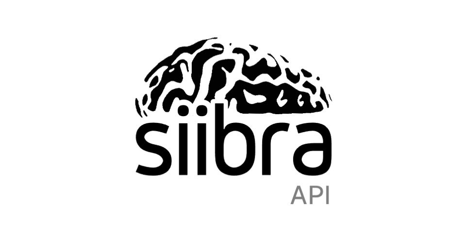

    

# siibra - API 

*Authors: Big Data Analytics Group, Institute of Neuroscience and Medicine (INM-1), Forschungszentrum Jülich GmbH*

Copyright 2020-2021, Forschungszentrum Jülich GmbH

> :warning: **`siibra-api` is still at an experimental stage.** The API of the library is not
stable, and the software is not yet fully tested. You are welcome to install and
test it, but be aware that you will likely encounter bugs.

## Overview

Siibra-API provides an easy REST access to the siibra-python features.

The main goal is to abstract the python functionalities in a way that they can be used via HTTP and make it more independent and accessible.

## Documentation

coming soon

## Usage examples

A list of all API endpoints and a playground to directly test it can be found here:

[Swagger API](https://siibra-api.apps-dev.hbp.eu/v1_0/docs#/)

## Acknowledgements

This software code is funded from the European Union’s Horizon 2020 Framework
Programme for Research and Innovation under the Specific Grant Agreement No.
945539 (Human Brain Project SGA3).
