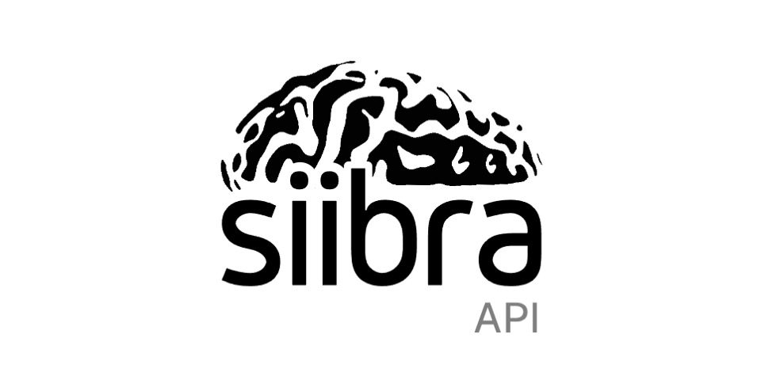

    

# siibra - API 

Copyright 2020-2021, Forschungszentrum Jülich GmbH

*Authors: Big Data Analytics Group, Institute of Neuroscience and Medicine (INM-1), Forschungszentrum Jülich GmbH*

> :warning: **`siibra-api` is still at an experimental stage.** The API of the library is not
stable, and the software is not yet fully tested. You are welcome to install and
test it, but be aware that you will likely encounter bugs.

## Overview

Siibra-API provides an easy REST access to the siibra-python features.

The main goal is to abstract the python functionalities in a way that they can be used via HTTP and make it more independent and accessible.

## Documentation

All of the public endpoints provided by siibra-api are documented by openapi, see [swagger](https://siibra-api-stable.apps.hbp.eu/v3_0/docs#/) [redoc](https://siibra-api-stable.apps.hbp.eu/v3_0/redoc).

Development documentations can be found on [readthedocs](https://siibra-api.readthedocs.io/) .

## Configuration

siibra-api can be configured by:

- environment variables, as indicated by the <./api/siibra_api_config.py> , or ...
- directly overwriting the <./api/siibra_api_config.py> file, by overwriting or docker volume mounting

## How to contribute

If you want to contribute to ``siibra-api``, feel free to fork it and open a
pull request with your changes. You are also welcome to contribute to
discussion in the issue tracker and of course to report issues you are
facing yourself. If you find the software useful, please reference this
repository URL in publications and derived work. You can also star the
project to show us that you are using it.

## Acknowledgements

This software code is funded from the European Union’s Horizon 2020 Framework
Programme for Research and Innovation under the Specific Grant Agreement No.
945539 (Human Brain Project SGA3).
