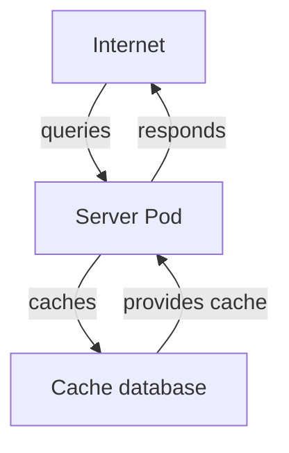

One of the most common strategies to improve performances of web applications is the use of caching. siibra-api can be configured to use a [gzipped b64 redis store][api.server.cache.redis.CacheGzipRedis] to cache responses, used in [fastapi middleware][api.server.api.middleware_cache_response]

## [Gzipped b64 redis store][api.server.cache.redis.CacheGzipRedis]

The redis store is designed to store key (gzipped base64 encoded) value. Whilst incur performance cost on read and on write, the advantage of such approach was the non-trivial improvement of resource efficiency.

## Caching criteria

The caching criteria can be found in the [fastapi middleware][api.server.api.middleware_cache_response]. 

In short, a response will be cached if and only if:

- HTTP verb is `GET` and
- auth header **not** provided and
- url.path does not contain banned keywords (`metrics`, `openapi.json`, `atlas_download`) and
- url.query does not contain banned keywords (`bbox=`, `find=`) and
- response is of type `application/json`

## Cache invalidation

As the key used in [fastapi middleware][api.server.api.middleware_cache_response] contains [siibra api version][api.siibra_api_config.__version__], on increment of siibra-api version, the cache will be invalidated.
