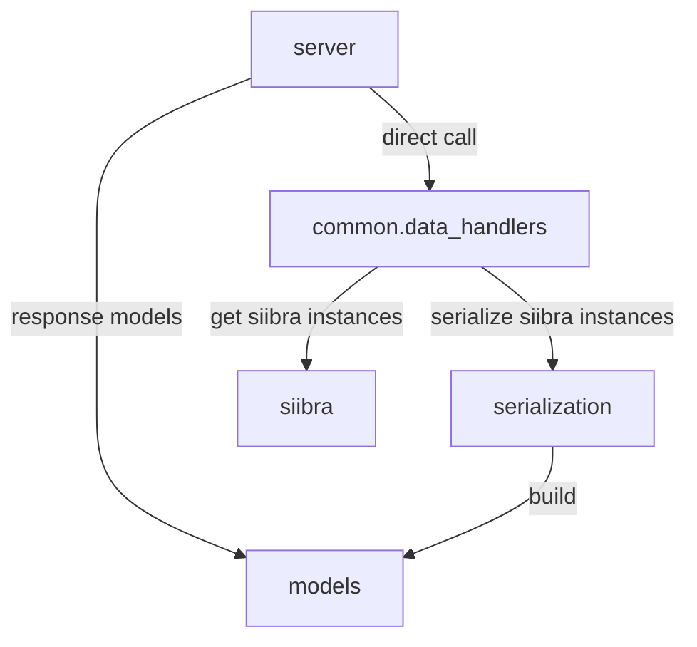
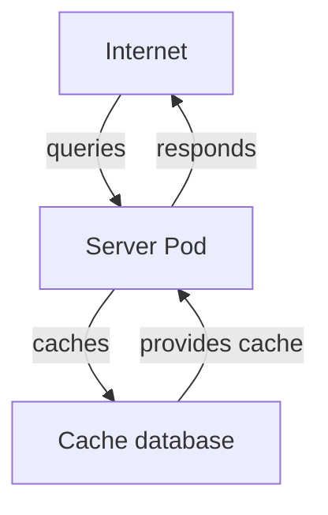
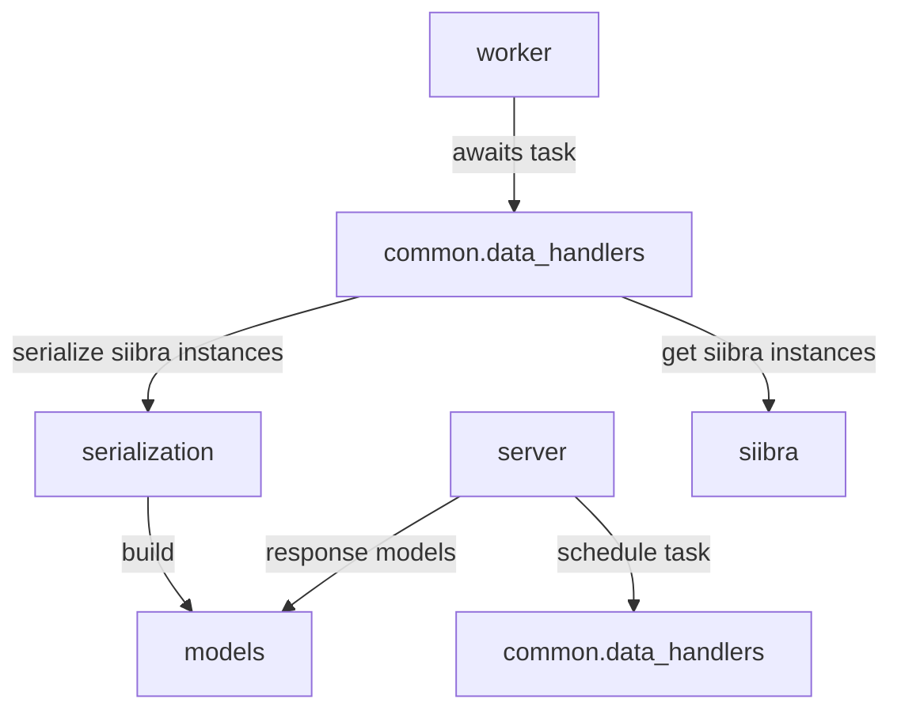
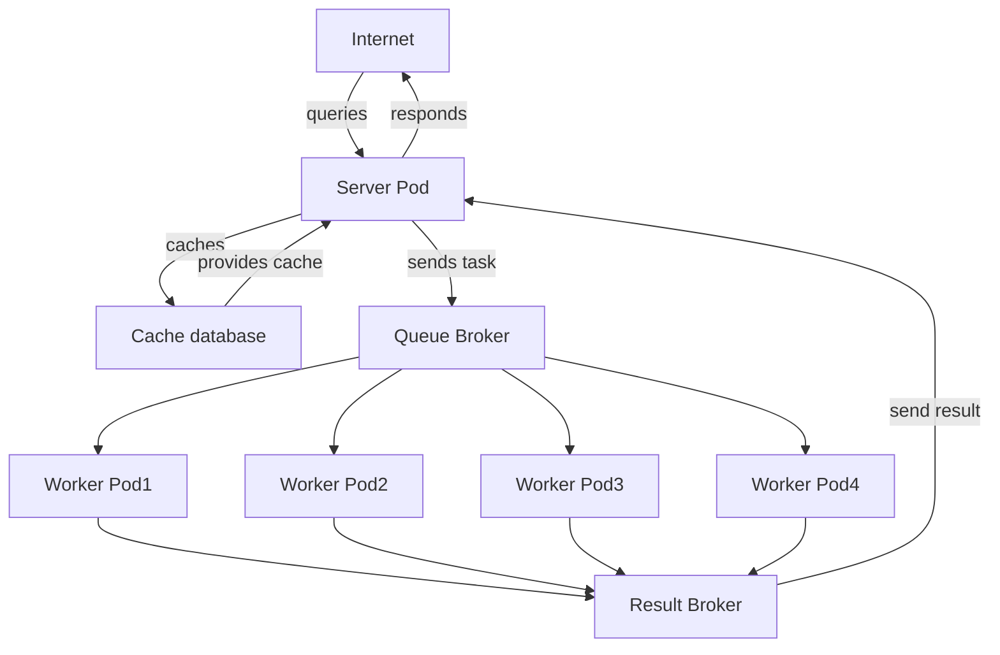

One of the metrics that are currently been optimised is the weighted throughput.

In this context, weighted throughput is measured by the response time of the routes offered by the deployed siibra-api, weighted by the route's business criticalness. 

In an effort to optimise weighted throughput, additional complexity to the service architecture will inevitably be introduced. The added complexity compromises the maintainability of siibra-api, and discourages external contributions.

To balance these two factors, siibra-api can be configured to run as all-in-one service or server-worker service.

## all-in-one

The all-in-one configuration provides a simple, easy to debug instance of siibra-api. 

As uvicorn spawns four worker threads by default, this configuration is ideal for local development.

### Pro & Con

Pro:

Easier to setup, easier to debug. Fewer moving parts, less likely to "break".

Con:

Does not scale easily. On production, available workers can easily be overwhelmed by more computationally expensive, less business critical queries, resulting in degredation in response time.

### module dependency graph

### architectural diagram

## server-worker

siibra-api can be configured to run with a server-worker architeture. This allows the deployed app be more robust on a production environment.

!!! note
    In order to achieve roughly the same performance, at least 4 worker nodes needs to be spawned.

### Pro & Con

Pro:

Robust, customizable, scale easily. Allow business critical routes/jobs to be prioritised.

Con:

Complex to setup, overhead (via message broker).

### Module dependency graph

### architectural diagram

