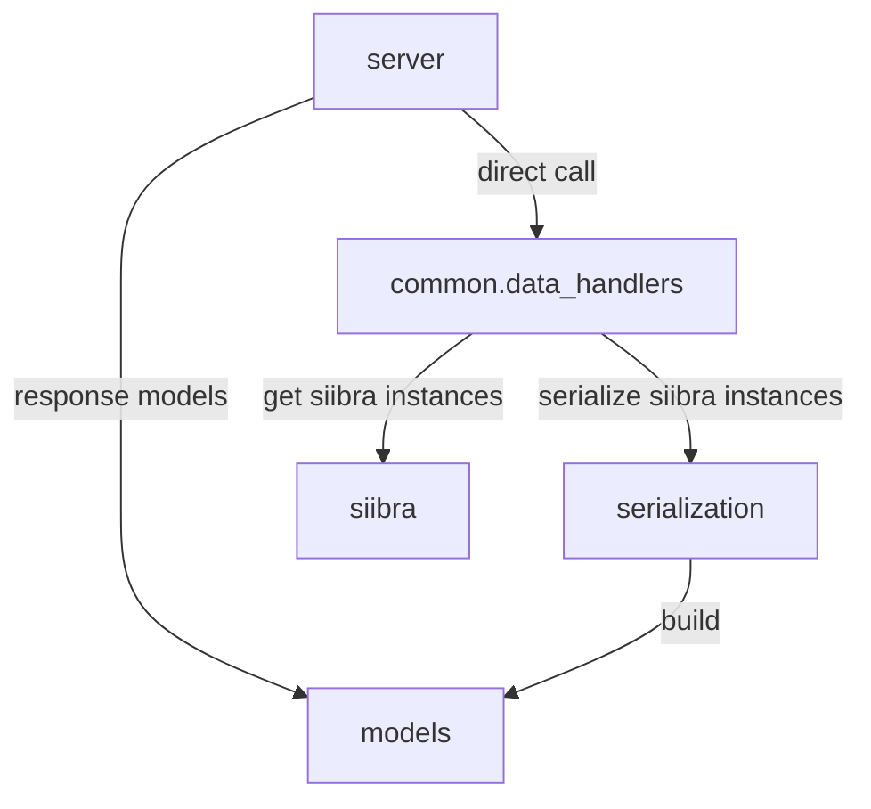
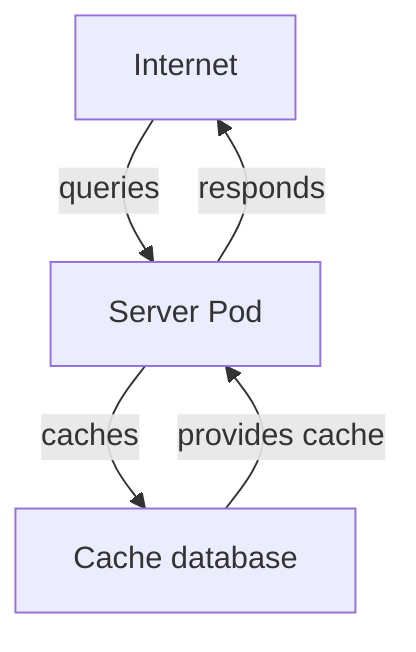
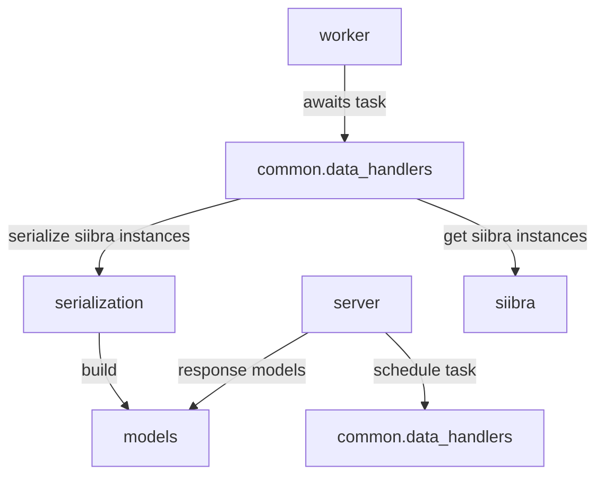
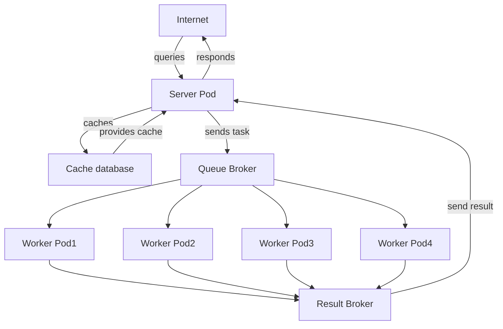

{WIP PLACEHOLDER}

## Current architectural designs

{WIP PLACEHOLDER}

### all-in-one

In an all in one 

#### module dependency graph



#### architectural diagram




#### How to activate

```bash
export SIIBRA_API_ROLE=all
uvicorn api.server.api
```

#### Pro & Con

Pro:

Easy to setup, easy to debug. Fewer moving parts, less likely to "break".

Con:

Does not scale easily. On production, available workers can easily be overwhelmed, resulting in 

### server-worker

On the contrary, the design that offers some flexibility is the server-worker design.

#### Module dependency graph



#### architectural diagram


